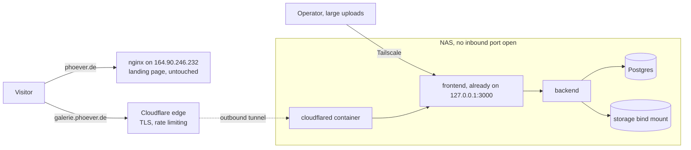

# Publishing PicPeak at galerie.phoever.de

Date: 2026-09-20
Status: approved, ready for an implementation plan

## Goal

Customers and the operator reach this PicPeak install over the public internet at
`https://galerie.phoever.de`. Customers open their gallery at
`https://galerie.phoever.de/gallery/<slug>`, the operator signs in at
`https://galerie.phoever.de/admin`.

Today the install answers only on the office LAN (`192.168.178.178:3000`) and over
Tailscale (`100.69.255.75:3000`). Nothing serves it publicly: no tunnel, no reverse
proxy entry, no hostname, no TLS.

## What already exists, and must keep working

| Thing | Where it lives | Must not break |
|---|---|---|
| `phoever.de` landing page ("PhoEver Agency", built with Framer) | nginx on `164.90.246.232`, a host the operator has no access to | Yes |
| Company email on `@phoever.de`, three mailboxes | IONOS mail servers `mx00.ionos.de` and `mx01.ionos.de`, an SPF record, three DKIM selectors and an autodiscover alias | Yes, critically |
| Authoritative DNS | IONOS (`ns1029.ui-dns.de` and three siblings) | Moves in this work |
| PicPeak stack | NAS at `/volume1/docker/picpeak`, `docker-compose.production.yml` | Yes |
| Tailscale | `tailscaled` container on the NAS, tailnet `tailee3dba.ts.net` | Yes, it is the admin path |

`galerie.phoever.de` does not resolve today, so the name is free.

## Verified record inventory

Read from the IONOS control panel on 2026-09-20 and cross-checked against live DNS. This
is the list that has to arrive in Cloudflare intact, and it is the artefact that cannot be
reconstructed once the nameservers have moved.

```text
CNAME  _dmarc                  dmarc.ionos.de
CNAME  _domainconnect          _domainconnect.ionos.com
MX     @            (10)       mx00.ionos.de
MX     @            (10)       mx01.ionos.de
TXT    @                       v=spf1 include:_spf-eu.ionos.com ~all
CNAME  s1-ionos._domainkey     s1.dkim.ionos.com
CNAME  s2-ionos._domainkey     s2.dkim.ionos.com
CNAME  s42582890._domainkey    s42582890.dkim.ionos.com
CNAME  autodiscover            adsredir.ionos.info
A      @                       164.90.246.232
A      www                     164.90.246.232
```

Three findings from verifying it, each of which removes or bounds a risk:

**DNSSEC is not enabled.** A DS query to the `.de` registry returns a signed proof of
absence. Had it been enabled, changing nameservers without first removing the DS record
would have taken the entire domain off the internet, mail included, rather than breaking
one service. That failure mode is not in play here.

**`mail` and `webmail` do not exist.** An earlier probe of this design reported them as
present. It was wrong: the probe read an exit code that `nslookup` sets to zero even for
a non-existent name. Re-checking against the answer text shows both as NXDOMAIN, and the
IONOS panel lists no record for either.

**The landing page certificate is issued by Let's Encrypt and expires 2026-12-03**, so the
remote host renews it itself rather than IONOS supplying it. Renewal works by Let's
Encrypt calling back to the host over the domain name, and that callback path answers
today, so keeping the two A records byte-identical is enough to protect it. Nothing about
this migration reaches that host.

> [!NOTE]
> `_domainconnect` exists so IONOS can auto-configure third-party services into this zone.
> It stops functioning once the zone is elsewhere. Copy it anyway: it is inert, and a
> record that is present and unused is cheaper than discovering later that it was needed.

## Decisions

### A subdomain, not a path under the landing page

The apex is taken by the company landing page. Serving PicPeak under
`phoever.de/gallery/` would mean splitting one hostname across two origins, which the
operator cannot arrange because the landing page host is not theirs to configure. It
would also force the whole frontend onto a base path: a Vite `base`, a React Router
`basename`, a narrowed cookie path, and a rewrite of every absolute URL the backend
generates for emails and QR codes. A subdomain costs one DNS record and no code.

The application already reserves `/gallery/<slug>` for customer galleries and `/admin`
for the admin area (`frontend/src/App.tsx`), so the requested URL shape comes out of the
existing routes untouched.

### Cloudflare Tunnel, not a port forward and not a rented gateway

A port forward on the office FRITZ!Box would put a NAS holding customer photos directly
on the internet, and would depend on the office line having a stable, non-shared public
address. A rented VPS running nginx and reaching the NAS over Tailscale avoids both the
DNS migration and the upload size cap, but costs money every month and adds a second
machine to maintain. The operator has already lost administrative access to one such
machine, which is the argument against acquiring another.

Cloudflare Tunnel opens nothing on the office router: the NAS dials outward. Cloudflare
terminates TLS, so no certificate has to be requested or renewed on the box.

### The whole zone moves to Cloudflare, because there is no cheaper option

Delegating only `galerie.phoever.de` to Cloudflare, leaving the apex and the mail records
at IONOS, would be the low-risk route. It is not available: Cloudflare offers subdomain
zones on Enterprise plans only, and Free and Pro plans support full-zone setup alone.
See <https://developers.cloudflare.com/dns/zone-setups/subdomain-setup/setup/>.

So the nameservers for `phoever.de` move to Cloudflare, mail records included. That makes
the DNS migration the one step in this work that can break something currently healthy,
and it is treated as its own phase with its own proof and its own rollback.

## Architecture



## Phase 1: Move DNS to Cloudflare

This phase ships alone. Nothing else starts until email is proven healthy afterwards.

1. Transcribe the complete record set from the IONOS control panel before touching
   anything. Done on 2026-09-20; see **Verified record inventory** above. Cloudflare's
   importer discovers records by querying names it can guess, so the records it reliably
   misses are the ones whose names cannot be guessed. DKIM is exactly that case, and this
   zone proves the point: the selector `s42582890._domainkey` is a string IONOS chose and
   is visible nowhere but that panel.
2. Create the zone in Cloudflare, let the importer run, then compare its result line by
   line against the inventory. Add by hand whatever is missing.
3. Set the apex and `www` to DNS-only, so Cloudflare answers the name but does not sit in
   the request path. The landing page then keeps its own certificate and its own
   behaviour, and this work cannot affect it.
4. Query the assigned Cloudflare nameservers directly, before the switch, and diff every
   answer against the same query put to the IONOS nameservers. This is the actual safety
   net, for the reason given below.
5. Change the nameservers at IONOS.
6. Prove mail end to end: send a message from an outside account to an `@phoever.de`
   address and read it in the real mailbox, then send one out and confirm it arrives
   without a spam verdict.

> [!WARNING]
> A missing DKIM record does not bounce mail. It degrades the domain's reputation, so
> outgoing messages start landing in spam folders days later, with nothing in any log on
> either side to point at the cause. The transcription in step 1 is what prevents this,
> and it cannot be reconstructed after the nameservers have moved.

Rollback: point the nameservers back at IONOS. The IONOS zone survives the switch, so the
old answers return once resolvers stop using the cached delegation.

> [!WARNING]
> That rollback is slow, and it cannot be made fast. The delegation lives in the `.de`
> registry, whose TTL is typically a full day and is not ours to shorten. Broken mail
> therefore stays broken for up to 24 hours after the rollback is issued. Treat the
> nameserver change as one-way for a day, which is why step 4 verifies the new zone
> against the old one while the old one is still authoritative: it is the only check that
> can still prevent the damage rather than merely start the clock on undoing it.

## Phase 2: Open the tunnel

Run `cloudflared` as a standalone container on the NAS, modelled on the `tailscaled`
container that already runs there: `restart: unless-stopped`, state on a bind mount under
`/volume1/docker/` so a reboot does not require re-authentication.

It is deliberately NOT added to `docker-compose.production.yml`. That file is repository
content shared with upstream, and this fork's policy keeps deployment-specific values out
of the repository. Adding a second compose file would also change the `-f` arguments that
the `deploy-nas` skill passes on every deploy, so a standalone container keeps the deploy
path exactly as it is.

Give the container the host's own network namespace and point the public hostname at
`http://127.0.0.1:3000`, the port the frontend already publishes.

The tempting alternative, attaching the container to the stack's Docker network and
targeting `picpeak-frontend:80`, is wrong here. A standalone container joined to a
Compose-managed network keeps a reference to that specific network. A deploy that brings
the stack down and back up can recreate the network, and the tunnel is then bound to one
that no longer exists. What the operator sees is every visitor getting an error after an
otherwise successful update, while the application itself is demonstrably healthy: a
failure whose symptom points away from its cause. Host networking has no such coupling,
adds no listener that is not already bound, and matches how `tailscaled` already runs on
this box.

Store the tunnel credential in a file with mode 600 under the deploy directory. It is a
secret, so it is recorded in `.claude/nas-profile.md` by location only, never by value.

## Phase 3: Tell the application its public address

Set `FRONTEND_URL=https://galerie.phoever.de` in `/volume1/docker/picpeak/.env`.

The backend builds every absolute URL it hands to a person from this value: gallery links
in customer email, printed QR codes, payment links. Left unset, it falls back to the
origin of whichever request triggered the work, and background jobs such as reminder
emails have no request at all, so recipients receive links pointing at `localhost`. The
precedence is implemented in `backend/src/utils/frontendUrl.js`.

Setting the environment variable also makes the Site URL field in admin settings
read-only, which is the wanted outcome: one place defines the public address, and a
database restore cannot silently change it.

> [!NOTE]
> `docker-compose.production.yml` declares `env_file: .env` for the backend, so a variable
> set only in `.env` does reach the container. The trap recorded in `CLAUDE.md` about
> every variable needing an explicit `environment:` entry describes the development
> compose file, not this one.

## Phase 4: Harden before opening the door

Until now the only callers were inside the house. Afterwards anyone can call, so two
things that are currently acceptable stop being acceptable.

1. Reset the admin password to something long and unique, and confirm no seeded or
   default credential survives.
2. Review the rate limits already configured in `frontend/nginx.conf` against what the
   Cloudflare edge now absorbs on its own, and close any gap rather than assuming one
   layer covers the other.

> [!CAUTION]
> The NAS has no scheduled backup and its array has no redundancy: `/proc/mdstat` shows a
> single-member mirror, so every byte sits on one disk. While the install is empty, losing
> it costs a reinstall. Opening it to customers is the moment real photographs belonging
> to other people start arriving, so a scheduled backup belongs in this work rather than
> after it.

## Phase 5: Verification

Every check runs from mobile data, not the office Wi-Fi. On the office network the LAN
route answers whether or not the tunnel works, so a green result there proves nothing.

| Check | Passes when |
|---|---|
| Public reachability | `https://galerie.phoever.de` loads and the browser reports a valid certificate |
| Admin sign-in | `https://galerie.phoever.de/admin` accepts the credentials |
| Customer path | A test event's share link opens as an anonymous visitor would see it |
| Download | A photo downloads whole, and the download allowance shown afterwards matches the server's count |
| Generated links | The email the system sends carries `https://galerie.phoever.de`, not an internal address |
| Landing page | `https://phoever.de` and `https://www.phoever.de` still load, unchanged |
| Certificate renewal | `http://phoever.de/.well-known/acme-challenge/<anything>` still answers, so the landing page can renew its own certificate before it expires on 2026-12-03 |
| Mail | Inbound and outbound mail on `@phoever.de` both still work |

## Known constraints

> [!IMPORTANT]
> Cloudflare's free plan rejects any single request body larger than 100 MB, at the edge
> rather than in the application. A large original uploaded through the public hostname
> therefore fails in a way that looks like a broken feature. Large uploads go over
> Tailscale, over the LAN, or through the watch folder. This has to become a habit rather
> than a discovery.

Every byte a customer downloads leaves through the office internet connection, so the
office upload speed is the ceiling on download performance for everyone.

`PICPEAK_CHANNEL=main` is a floating tag, so the running version cannot be named by tag
and a rollback has to go by image digest. Publishing does not change this, but it does
raise the cost of a bad deploy, because outsiders now see the result.

## Files this work touches

| File | Change |
|---|---|
| `/volume1/docker/picpeak/.env` (on the NAS, not in git) | Add `FRONTEND_URL` |
| `/volume1/docker/cloudflared/` (on the NAS, not in git) | New container state and credential |
| `.claude/nas-profile.md` | Fill in the Publishing section, currently all `TODO` |
| `docs/superpowers/specs/2026-09-20-publish-galerie-subdomain-design.md` | This document |

No application code changes.
