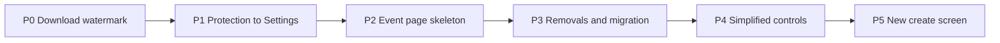

# Event form redesign: create and edit screens

Status: draft for review, 2026-09-28
Branch: `worktree-event-form-redesign`

## 1. Why

The create screen and the event page have grown into two separate forms that ask for
the same things in different ways, mixed with rarely used technical options at the
same level as the event name. Photographers and staff do not know what to pick.

Measured problems in the current code:

1. **Two forms that drift.** `CreateEventPage.tsx` and `EventInformationCard.tsx` are
   written independently. Expiry is "days after the event" on one and a date on the
   other; the welcome message has an editor on one and a bare textarea on the other;
   the password generator exists only on create; about 15 settings exist only on the
   event page.
2. **Two save models on one page.** One large block is edited behind an "Edit" button
   and saved from the header. About nine other cards save themselves. The header save
   fires two independent requests (event PUT, then feedback PUT) so a save can land
   half way, and Cancel does not revert the feedback toggles.
3. **Flat hierarchy.** The create screen shows about 20 controls on open and close to 50
   with every sub-option expanded; the feedback block alone has about 20.
4. **Settings that look per event but are not.** Several per-event values are copied
   from global settings once at creation and never follow them again, so changing a
   global setting silently does nothing for existing galleries.

## 2. Goals and success criteria

- A normal event is created in under a minute, typing at most 6 fields
  (type is preselected; name, date, customer name, customer email). Everything else has
  a sensible default.
- Every setting has exactly one place where it is edited.
- A new staff member creates an event without asking.
- The event page has one save model: a single sticky save bar.

Non-goals:

- No new visual identity. The admin keeps its current look; a visual identity for the
  whole admin is a separate project.
- No change to the public API shape. Backend changes are limited to how existing values
  are resolved, one data migration, and a few new settings keys.
- Feature-flagged cards that are off in production (slideshow, reminder emails, face
  recognition) keep their code and their own save buttons.

## 3. Decisions taken with the operator

| Topic | Decision |
|---|---|
| Who uses it | The owner and staff, mostly on desktop, occasionally quick edits on a phone |
| When events are created | After the shoot, when preparing the upload |
| Create screen shape | One page, essentials visible, the rest under "Advanced options" |
| One form or two | The create screen is assembled from the same section components as the event page settings |
| Defaults come from | Global settings and duplicating an old event. Event type carries only the theme |
| Event page layout | Overview tab (daily use) separated from a Settings tab (grouped, left rail) |
| Saving | One sticky save bar for every setting on the page |
| Advanced options | Per section "Show advanced options", plus an "Expert mode" switch that expands them all; stored per browser |
| Customer | Free-text name and email only (the account picker already hides itself while the customer portal is off) |
| Admin notification email | One global setting, no per-event field |
| Gallery password | Generated automatically, shown in clear with Copy and Regenerate, no confirm field |
| Client access | Kept on the create screen, same auto-generated password treatment |
| Expiry | A date, with quick buttons 30 / 60 / 90 days / Never |
| Theme | Not asked at creation. On the event page all look-and-feel settings live in one Appearance section |
| Guest feedback | Three modes: Off / Client picks photos (favorites only) / Full. Individual toggles in Advanced |
| Download protection | Entirely in global Settings, applied live to every gallery. "Allow downloads" stays per event |
| Guest uploads | Removed, together with reveal mode |
| External folder | Kept, offered in Advanced on create and in the Settings tab |
| Download allowance and orders | Kept as today, but saved through the save bar |
| Event start and end time | Removed from the UI |
| Required-field toggles | Kept, except "require admin email" which becomes meaningless |
| Hidden non-default values on old events | No extra notice, except where needed to show the true state (see 5.6) |
| Changing the event type | Ask before overwriting a theme the user customised by hand |
| Turning the password off on a published gallery | Confirmation dialog |
| Changing a password | No extra step |
| After Create | Created as a draft, open the event page with a "next steps" checklist |
| Unsaved changes | Block navigation and ask |
| Missing permission | Show the section locked, say which permission is missing |
| Settings only, never per event | Feedback rate limit, keyboard shortcut mode, hero logo size and position, login page logo, devtools detection, canvas rendering |
| Feature flags that are off | Keep the code, show them in an "Extra features" section only when a flag is on |
| Delivery | Six phases on one branch, deployed to the NAS once at the end |
| Mockup | None. The spec is the design artifact |

## 4. Findings that shape the design

These come from reading the code, not from reproducing on the box.

1. **Downloaded files are watermarked whenever the gallery view is.** Every download
   path applies the watermark when the global Branding watermark is on OR the event flag
   is on (`resolveWatermarkSettings` in `backend/src/services/downloadRendition.js`, the
   same rule inlined in `backend/src/routes/gallery/downloads.js` for download-all and
   download-selected, and in `backend/src/services/downloadZipService.js`). There is no
   way to watermark the view but deliver clean files. The secure-download route in
   `backend/src/routes/secureImages.js` uses a third rule (global only).
2. **`watermark_text` does nothing.** It is threaded through every download path, but
   `applyWatermark` never reads `settings.text` (`backend/src/services/watermarkService.js`).
3. **Pre-built guest zips keep old watermarks.** `downloadZipService.invalidateAll()` is
   documented for a global watermark change but `PUT /admin/settings/branding` never
   calls it.
4. **Image-security settings are creation-time copies.** `default_protection_level`,
   `enable_devtools_protection`, `enable_canvas_rendering` and `default_image_quality`
   are copied into the event row once (`backend/src/services/eventSettings.js`, the
   "creation-time only" comment). `disable_right_click` has no global setting at all.
5. **Right-click, devtools and canvas are enforced only in the browser.** The backend only
   exposes the three flags (`routes/gallery/metadata.js`, `services/galleryQueryService.js`);
   `GalleryView.tsx`, `PhotoLightbox.tsx` and the layout components act on them.
6. **Protection levels `enhanced` and `maximum` do not work end to end.** The backend
   hands out secure URL templates with a `{{token}}` placeholder that the frontend never
   fills (`frontend/src/services/secureToken.service.ts` is imported nowhere). Out of
   scope here, recorded in section 9.
7. **No global admin email exists.** `event.admin_email` is the only recipient for the
   `archive_complete` and admin `gallery_expired` mails, is the `{{admin_email}}` contact
   address in customer templates, and travels in workflow payloads as `adminEmail`.
8. **Per-event feedback rate limiting is fake.** `enable_rate_limiting`,
   `rate_limit_window_minutes` and `rate_limit_max_requests` are stripped by
   `feedbackService.js` before saving. Removing them from the UI changes nothing.
9. **`keybind_mode` is per event**, seeded once from `event_default_keybind_mode`, and
   read by the lightbox from the event.
10. **Hero logo position and the login page logo have no global equivalent.**
    `hero_logo_size` and `hero_logo_visible` already inherit from Branding when NULL.
    `branding_logo_position` is a different concept (the header) and must not be reused.
11. **Guest uploads and reveal mode switch off cleanly.** With both false for every event,
    the upload route returns 403, every reveal gate is a no-op, the scheduler matches
    nothing, and the gallery behaves as a normal view and download gallery.
12. **Event date and type cannot be edited after creation** anywhere in the admin, although
    `PUT /admin/events/:id` accepts both.
13. **Existing bugs on the event page:** the event logo upload invalidates the wrong query
    key (`['event', id]` instead of `['admin-event', id]`) so the preview never refreshes;
    `customer_email` is only sent when non-empty, so it can never be cleared.
14. **The router cannot block navigation today.** The app uses `<BrowserRouter>`;
    `useBlocker` needs a data router (`createBrowserRouter`). The only existing guard is a
    `beforeunload` listener in `CMSPage.tsx`.

## 5. Target design

### 5.1 Event page structure

Tabs: **Overview**, **Photos**, **Categories**, **Downloads** (the ledger), **Guests**
(only in per-guest identity mode, as today), and a new **Settings** tab.

**Overview** is for daily use and holds no editable settings:

- Status: draft banner with Publish and notify, expiry warning with Extend 7 days.
- "Next steps" checklist while the event is a draft (5.5).
- Share link card: copy, QR downloads, show password, reset password, resend email.
- Short URLs.
- Client access link: copy and regenerate (the switch and password move to Settings).
- Photo statistics, feedback moderation panel, archive status.
- Actions: send gallery email, duplicate, archive.

**Settings** uses the grouped left rail pattern already used by `SettingsPage.tsx`
(`lg:grid-cols-[220px_1fr]`, sticky rail, `<select>` on mobile), extracted into a shared
layout component. Sections and their contents:

| Section | Always visible | Advanced |
|---|---|---|
| Details | Event date, event type, customer name, customer email, phone (when enabled), expiry | Welcome message |
| Access | Password on/off, gallery password (generate, copy), client access on/off and its password | |
| Appearance | Theme preset with live preview, hero photo | Full theme customizer, CSS template, hero crop position, hero as social preview, logo in hero (inherit / show / hide), event logo upload, promotional banner, info banner |
| Guest interaction | Feedback mode (Off / Client picks photos / Full) | Identity mode, individual feedback types, per-guest caps, require name and email, moderate comments, show feedback to guests |
| Downloads | Allow downloads, download allowance on/off, auto-approve orders | Free downloads, price per extra photo, download resolution, create order (action) |
| Advanced | | Photo source (upload or external folder, watch folder), photo limit, default photo sort |
| Extra features | Only when a flag is on: slideshow, reminder override, face recognition. They keep their own save buttons | |

The event name keeps its Rename dialog, because renaming changes the slug and the share
link. It is reached from the header as today and from the Details section.

### 5.2 One save model

- Every control in the Settings tab writes into one page-level draft. A sticky bar at the
  bottom appears when the draft differs from the saved event and shows "N unsaved
  changes" with Discard and Save.
- Save sends the event PUT first. The feedback PUT and the download-allowance PUT are
  sent only after it succeeds. When a later request fails, the bar stays, names what did
  not save, and keeps the draft, so nothing is silently half saved.
- Discard restores every draft value, feedback included.
- Actions (reset password, regenerate client link, create order, upload a logo, rename)
  are buttons that act immediately and say so. They are never part of the draft.
- The old header Edit, Save and Cancel buttons go away; the page is always editable in
  the Settings tab.
- Navigation away with unsaved changes (another tab of the page, the admin sidebar,
  browser back, closing the tab) asks for confirmation. This requires moving `App.tsx`
  from `<BrowserRouter>` to `createBrowserRouter` with `createRoutesFromElements`, so
  `useBlocker` works, plus a `beforeunload` listener for closing the tab.

### 5.3 Advanced options and expert mode

- Each section has a "Show advanced options" row that expands its advanced controls.
- An "Expert mode" switch at the top of the Settings tab expands every section's
  advanced controls at once. It is stored in `localStorage` (wrapped in try/catch), per
  browser.
- Staff restrictions are done with permissions, never by hiding: a section the user
  cannot edit is shown locked with the missing permission named, like the existing
  "watch folder" checkbox.

### 5.4 Create screen

Assembled from the same section components as the Settings tab, in "create" mode:

- Visible: event type tiles, event name, event date, customer name, customer email, phone
  (when enabled), gallery password (pre-generated), expiry quick buttons, client access
  switch, auto-approve download orders.
- Advanced options: welcome message, photo source, photo limit, default photo sort,
  feedback mode.
- Gone from create: theme and CSS template (taken from the event type and Branding),
  admin email, start and end time, guest uploads, every protection option.
- Submit creates a draft and opens the event's Overview with the checklist.

### 5.5 "Next steps" checklist

Shown on Overview while the event is a draft. Items, each ticked from real data:

1. Upload photos (ticked when the photo count is above 0).
2. Choose a hero photo (ticked when `hero_photo_id` is set).
3. Publish and send to the client (the existing publish dialog).

### 5.6 Controls that summarise several values

The feedback mode selector maps to the individual toggles:

| Mode | feedback_enabled | favorites | likes | ratings | comments | reactions | color labels |
|---|---|---|---|---|---|---|---|
| Off | false | unchanged | unchanged | unchanged | unchanged | unchanged | unchanged |
| Client picks photos | true | true | false | false | false | false | false |
| Full | true | true | true | true | true | true | unchanged |

An event whose toggles match no mode shows a fourth state, **Custom**, with the advanced
controls open. It is never forced into a mode, because that would change the gallery
without anyone noticing.

### 5.7 Global settings after the redesign

| Setting | Where | Behaviour |
|---|---|---|
| Watermark on gallery images | Branding (exists) | Live, as today |
| Watermark on downloaded files | Branding, new switch, default off | Live. The per-event `watermark_downloads` is ignored |
| Block right-click | Image security, new | Live for every gallery |
| Detect developer tools | Image security (exists) | Becomes live for every gallery |
| Canvas rendering in the lightbox | Image security (exists) | Becomes live for every gallery |
| Default protection level, image quality | Image security (exists) | Stay creation-time defaults (see section 9) |
| Keyboard shortcut mode | Events (exists) | Becomes live for every gallery |
| Hero logo size | Branding (exists) | Always global. Per-event value ignored |
| Hero logo position | Branding, new | Always global |
| Logo on the gallery password page | Branding, new | Always global |
| Notification email | General, new | Recipient for admin mails and `{{admin_email}}`, see 5.8 |
| Require admin email | Events | Removed |

"Ignored" means the gallery resolves the value from the global setting and the event
column is left untouched in the database. No column is dropped, which keeps the schema
aligned with upstream and makes rollback a code revert.

### 5.8 Notification email

- New key `general_notification_email`, edited in Settings > General.
- Resolution everywhere an admin address is needed: the global value when set, otherwise
  the event's own `admin_email`, otherwise skip, as today.
- Applies to the `archive_complete` mail, the admin copy of `gallery_expired`, the
  `{{admin_email}}` template variable, and the `adminEmail` workflow payload.
- New events store the global value in `admin_email`, so anything still reading the
  column directly keeps working.

## 6. Phases

All phases land on one branch and deploy once at the end (section 8). Each phase ends
green on its own gates, so the branch is always in a working state. A detailed
implementation plan is written for each phase right before it starts, against the code
the previous phase left behind.

### P0: Download watermark

Fixes finding 1, 2 and 3.

- One resolver decides the watermark for every download path: single download, download
  all, download selected, pre-built zip, custom-resolution jobs, secure download.
- Downloads are watermarked only when the new Branding switch "Watermark on downloaded
  files" is on. Default off.
- The per-event `watermark_downloads` and `watermark_text` stop influencing downloads.
- Saving Branding with a watermark change invalidates every pre-built zip; the migration
  that introduces the new key also invalidates them once, so zips built before the fix
  are not served again.
- Tests: resolver unit tests for each combination; one test per download path proving it
  calls the resolver; zip invalidation on branding save.

### P1: Download protection to Settings

- New global `block_right_click` in Image security, seeded by a migration: the Image
  security PUT only updates rows that already exist, so an unseeded key is silently
  never saved. Devtools detection and canvas
  rendering are relabelled from "default for new events" to "applies to every gallery".
- The gallery metadata and query services resolve right-click, devtools and canvas from
  the global settings. The event columns are ignored.
- The protection block disappears from the event page and never appears on create.
- "Allow downloads" moves to the Downloads section (it is a sales decision, not
  protection).
- Before deploy, report how many events currently differ from the global values, since
  those galleries change behaviour on deploy (section 8).
- Tests: resolver tests; gallery metadata returns the global values regardless of the
  event row.

### P2: Event page skeleton

Structure only. Every control keeps its current behaviour; it only moves.

- Router migration to `createBrowserRouter` (its own commit, verified by the e2e smoke
  suite before anything else changes).
- Shared left-rail layout extracted from `SettingsPage.tsx` and reused by the Settings
  tab.
- Overview and Settings tabs as in 5.1; the section components hold today's controls.
- Page-level draft, sticky save bar, ordered saves, Discard, navigation guard.
- Client access switch and password, download allowance and auto-approve, download
  resolution join the draft.
- Expert mode and per-section advanced toggles.
- Fixes finding 13 (logo preview refresh, clearing the customer email).
- Tests: draft dirty tracking and change count; ordered save with a failing second
  request; Discard restores feedback; navigation guard; each section renders the
  controls it owns. A check that every control in today's inventory exists in exactly
  one section.

### P3: Removals and data migration

- Remove guest uploads and reveal mode from the admin UI. Data migration sets
  `allow_user_uploads` and `reveal_mode` to false on every event (counted on production
  before deploy).
- Remove the start and end time fields from the UI. Stored values stay.
- Remove the fake per-event rate limiting fields (finding 8).
- Keyboard shortcut mode becomes live global; the per-event control goes.
- New Branding keys for hero logo position and the password page logo; the gallery
  resolves size, position and password page logo from Branding only; the per-event
  controls go.
- Notification email (5.8); remove "require admin email" from Settings > Events, from
  public settings, from create validation, and from the e2e spec that toggles it.
- Tests: migration up on the Postgres test database; resolver tests for the logo and
  keybind values; notification recipient resolution for each mail.

### P4: Simplified controls

- Feedback mode selector with the Custom state (5.6).
- Expiry as a date with quick buttons, the same component on both screens. "Never" is
  hidden when Settings require an expiry.
- Passwords generated automatically, shown in clear with Copy and Regenerate; no confirm
  field. Turning the password off on a published gallery asks for confirmation.
- Banners as inherit by default, opened only to override.
- Appearance section with live preview; changing the event type asks before overwriting
  a hand-customised theme.
- Event date and event type editable in Details (finding 12).
- The welcome message uses one editor on both screens.
- Tests: mode mapping both directions including Custom; expiry quick buttons; password
  confirm dialog only when published; type change prompt only when the theme was
  customised.

### P5: New create screen

- Create page rebuilt from the section components in create mode (5.4).
- Draft created, redirect to Overview, checklist (5.5).
- Keeps the double-submit guard and the client-access behaviour pinned by
  `createEventDoubleSubmit.test.tsx` and `createEventClientAccess.test.tsx`.
- Update `tests/e2e/admin-create-event-ui.spec.ts` for the new labels (no confirm
  password, no admin email).
- Tests: create payload carries the defaults; required fields honour the Settings
  toggles; advanced options collapsed by default.

## 7. Cross-cutting rules

- Every new user-facing string gets `en`, `de` and `vi` keys in the same change. Keys
  that become unused are left in place (the extractor's prune is never run).
- New logic goes in `backend/src/services/`, not in routes.
- Anything written into the repo avoids the em-dash and the en-dash.
- Frontend gate per phase: `npm run lint` and the Vitest files touched. The six files
  known to fail on a clean checkout (`.claude/rules/frontend.md`) are compared against
  a clean tree, not debugged.
- Backend gate per phase: `npm run lint` and the Jest files touched. `jest.setup.js`
  keeps its `DATABASE_CLIENT` pin. Postgres suites use `PICPEAK_PG_TEST_URL`.
- Baselines are taken in the same worktree with the same command. The worktree has no
  `backend/.env`, so a suite that needs one is run with the file copied in, never
  compared against the main checkout.
- After any rebase onto upstream that removed an export, grep for the removed name.

## 8. Deploy

One deploy at the end, through the `deploy-nas` skill, which backs up the database first.

Before deploying, measured on production and reported to the operator:

1. Events with guest uploads or reveal mode on (P3 migration turns them off).
2. Events whose right-click, devtools or canvas values differ from the global settings
   (P1 changes those galleries).
3. Events whose keybind mode, hero logo size, hero logo position or password page logo
   differ from the global value (P3 changes those galleries).
4. Events whose `admin_email` differs from the new notification email (their admin mails
   go to the global address after deploy).
5. Pre-built zips that will be invalidated (P0).

After deploying: health endpoint, a gallery opened as a guest, one single download and
one zip download checked for the absence of a watermark, and the create flow run once.

## 9. Out of scope, recorded

- Protection levels `enhanced` and `maximum` do not work end to end (finding 6). The
  default level stays a creation-time value; fixing or removing the levels is its own
  piece of work.
- The hero image ETag ignores the watermark, so a watermark toggle can serve a cached
  image for up to an hour.
- Clearing the watermark logo URL in Branding leaves the logo path the service uses.
- `feedback_notification_email` is seeded but unused.
- Visual identity for the whole admin.

## 10. Risks

| Risk | Mitigation |
|---|---|
| Router migration breaks a route | Own commit, e2e smoke suite, route tree kept identical |
| A control is lost while moving sections | Inventory check test in P2 |
| Galleries change behaviour on deploy (protection, logo, keybind) | Counts reported before deploy (section 8), operator decides |
| Half-saved event after a partial failure | Ordered saves, bar names what failed and keeps the draft |
| Upstream merges conflict on these screens | Accepted; backend API and schema stay unchanged so backend fixes still merge |
