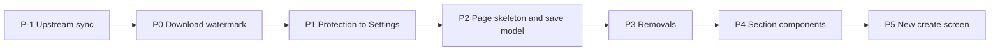

# Event form redesign: create and edit screens

Status: draft for review, revision 2, 2026-09-28
Branch: `worktree-event-form-redesign`

Revision 2 folds in three independent verification passes against the code (backend
paths, frontend control inventory, design critique). Line numbers are deliberately left
out: the fork is 144 commits behind upstream and a sync is proposed first (P-1), which
moves most of them. Each phase plan re-locates the code it touches.

## 1. Why

The create screen and the event page have grown into two separate forms that ask for
the same things in different ways, mixed with rarely used technical options at the
same level as the event name. Photographers and staff do not know what to pick.

Measured problems in the current code:

1. **Two forms that drift.** `CreateEventPage.tsx` and `EventInformationCard.tsx` are
   written independently. Expiry is "days after the event" on one and a date on the
   other; the welcome message has an editor on one and a bare textarea on the other;
   about 25 settings exist only on the event page.
2. **Several save models on one page.** One block is edited behind an "Edit" button and
   saved from the header; about nine cards save themselves; the feedback settings have
   a second editor on `/admin/events/:id/feedback` under a different query key. The
   header save fires the event PUT and the feedback PUT in parallel, so a save can land
   half way, and Cancel does not revert the feedback toggles.
3. **Flat hierarchy.** The create screen shows about 20 controls on open and close to 50
   with every sub-option expanded; the feedback block alone has about 20.
4. **Settings that look per event but are not.** Several per-event values are copied
   from global settings once at creation and never follow them again, so changing a
   global setting silently does nothing for existing galleries.

## 2. Goals and success criteria

- A normal event is created in under a minute, typing at most 6 fields (type is
  preselected; name, date, customer name, customer email). Everything else has a
  sensible default.
- Every setting has exactly one place where it is edited.
- A new staff member creates an event without asking.
- The event page has one save model: a single sticky save bar. The only exception is
  the feature-flagged cards in "Extra features", which are off in production.

Non-goals:

- No new visual identity. The admin keeps its current look; a visual identity for the
  whole admin is a separate project.
- No schema change (no DDL). Backend changes are listed honestly in 5.10 and per phase:
  value resolvers, request validators, a few new settings keys, and removing the
  "require admin email" rule. Response shapes stay compatible: fields that stop meaning
  anything are still returned.
- Feature-flagged cards that are off in production (slideshow, reminder emails, face
  recognition) keep their code and their own save buttons.
- No optimistic locking between two admins; last write wins as today (5.2 narrows it).

## 3. Decisions taken with the operator

| Topic | Decision |
|---|---|
| Who uses it | The owner and staff, mostly on desktop, occasionally quick edits on a phone |
| When events are created | After the shoot, when preparing the upload |
| Create screen shape | One page, essentials visible, the rest under "Advanced options" |
| One form or two | The create screen is assembled from the same section components as the event page settings |
| Defaults come from | Global settings and duplicating an old event. Event type carries only the theme |
| Event page layout | Overview tab (daily use) separated from a Settings tab (grouped, left rail) |
| Saving | One sticky save bar for every setting on the page, Extra features excepted |
| Advanced options | Per section "Show advanced options", plus an "Expert mode" switch that expands them all; stored per browser |
| Customer | Free-text name and email. The account picker stays behind the `customerPortal` flag, which is off |
| Admin notification email | One global setting, no per-event field |
| Gallery password | Generated automatically, shown in clear with Copy and Regenerate, no confirm field |
| Client access | Kept on the create screen, same password treatment |
| Expiry | A date, with quick buttons 30 / 60 / 90 days / Never |
| Theme | Not asked at creation. On the event page all look-and-feel settings live in one Appearance section |
| Guest feedback | Three modes: Off / Client picks photos / Full. Individual toggles in Advanced |
| Download protection | Entirely in global Settings, applied live to every gallery. "Allow downloads" stays per event |
| Watermark | Gallery images keep the Branding watermark. Downloaded files are clean by default |
| Guest uploads | Removed, together with reveal mode |
| External folder | Kept, offered in Advanced on create and in the Settings tab |
| Download allowance and orders | Kept as today, but saved through the save bar |
| Event start and end time | Removed from the UI |
| Required-field toggles | Kept, except "require admin email" which becomes meaningless |
| Hidden non-default values on old events | No extra notice, except where needed to show the true state (5.7) |
| Changing the event type | Ask before overwriting a theme the user customised by hand |
| Turning the password off on a published gallery | Confirmation dialog |
| Changing a password | No extra step |
| After Create | Created as a draft, open the event page with a "next steps" checklist |
| Unsaved changes | Block navigation and ask, on the event page and on the create screen |
| Missing permission | Show the section locked, say which permission is missing |
| Settings only, never per event | Feedback rate limit, keyboard shortcut mode, hero logo size and position, password page logo, devtools detection, canvas rendering |
| Feature flags that are off | Keep the code, show them in an "Extra features" section only when a flag is on |
| Delivery | Phases on one branch, deployed to the NAS once at the end |
| Mockup | None. The spec is the design artifact |

### 3.1 Operator decisions after verification

Decided 2026-09-28.

| # | Question | Decision | Affects |
|---|---|---|---|
| O1 | Sync upstream (144 commits, about ten security fixes) before P0 | Yes, as phase P-1 | 6, 8 |
| O2 | Turn on recoverable gallery passwords (`security_gallery_password_recoverable`), so a generated password can be shown again and prefilled when publishing | Yes | 5.4 |
| O3 | Expiry quick buttons count from today, not from the event date | From today | 5.8 |
| O4 | The `{{admin_email}}` contact address in customer mails follows the global notification email, so it also changes for existing galleries | Yes | 5.11 |
| U1 | Upstream's own per-event download limit (#1568), which overlaps the fork's allowance | Removed from the fork (reverted) | 6 |
| U2 | Vietnamese strings missing after the sync | Translated in full during P-1 | 7 |
| U3 | Deploy P-1 on its own | No: the project deploys once at the end | 8 |

### 3.2 P-1 outcome (2026-09-28)

- Merged upstream `55deab96` (commit `44a408c6`), reverted #1568 (`0100fa8c`), and
  translated 1449 `vi` strings (`9fa290dc`). Upstream moved on to `866e168f` while the
  sync ran: five more commits, none of them security fixes, which need a small second
  sync before the deploy.
- The secure-image token routes are gone (#1669), so the secure-download allowance gap
  (finding 4) is closed and P0 covers five download paths.
- Fixed on the way because the merged tree did not build or test clean: `Button` gains a
  `danger` variant, the public quote line item type declares `id`, and two file handles
  that leaked on Node 25 are closed (`validateFileContent`, and the EXIF credit reader
  skips files too small to hold metadata). The public quote view does not send line
  item ids, so the package-sum check matches children by position only: an upstream bug,
  left as is.
- Test baseline on this machine: 27 upstream backend suites and one frontend suite fail
  identically on pristine upstream (environment), on top of the fork's 7 known failures.

## 4. Findings that shape the design

These come from reading the code, not from reproducing on the box.

1. **Downloaded files are watermarked whenever the gallery view is.** Every download
   path applies the watermark when the global Branding watermark is on OR the event flag
   is on: `resolveWatermarkSettings` in `services/downloadRendition.js` (single download,
   custom-resolution jobs), the same rule inlined in `routes/gallery/downloads.js`
   (download all, download selected) and in `services/downloadZipService.js` (pre-built
   zip). Before P-1 the secure-download route in `routes/secureImages.js` used a third
   rule; the sync removed that route.
2. **`watermark_text` does nothing.** `applyWatermark` renders `settings.companyName`
   and never reads `settings.text`. The text is still part of the job dedup hash, so
   dropping it makes every ready custom-resolution job undeliverable once; they rebuild
   on request.
3. **Pre-built guest zips keep old watermarks.** `downloadZipService.invalidateAll()` is
   in memory and is never called by the Branding save, the watermark logo upload, or a
   company name change (the text watermark).
4. **Secure-download ignores the download allowance.** `GET
   /:slug/secure-download/:photoId/:token` checks `allow_downloads` but never calls the
   quota gate or the resolution policy that every other download path uses. Upstream
   `10619d26` (#1669) removes the secure-image token routes entirely.
5. **Image-security settings are creation-time copies.** `default_protection_level`,
   `enable_devtools_protection`, `enable_canvas_rendering` and `default_image_quality`
   are copied into the event row once (`services/eventSettings.js`). They are stored
   multiply JSON encoded and must be read with `decodeSettingValue` /
   `readBooleanSetting`, not `getAppSetting`. Two dormant rows seeded by migration 037,
   `default_disable_right_click` and `default_watermark_downloads`, are read by nothing.
   The Image security PUT only updates rows that exist and only keys on its whitelist.
6. **Right-click, devtools and canvas are enforced only in the browser**, from the
   `/photos` payload (`galleryQueryService.js`). `use_canvas_rendering` is emitted twice
   there and the `protectionSettings` spread wins. The frontend also switches devtools
   detection on for `protection_level` enhanced or maximum and forces canvas for
   maximum (`GalleryView.tsx`, `PhotoLightbox.tsx`, `PremiumLightboxImage.tsx`).
7. **Protection levels `enhanced` and `maximum` do not work end to end.** The backend
   hands out URL templates with a `{{token}}` placeholder the frontend never fills.
8. **Admin addresses.** `event.admin_email` is the only recipient of `archive_complete`
   and the admin copy of `gallery_expired`, the only source of `{{admin_email}}` (the
   `gallery_expired` templates), and the `adminEmail` of the `gallery.expiring`,
   `gallery.expired` and `gallery.published` workflow payloads. Workflows, approvals,
   invoices and contracts already use `business_profile.email` as the admin inbox. Quote
   and contract conversions fill `admin_email` with the acting admin, else the
   customer's address, else `admin@picpeak.local`; duplicate copies the source value.
9. **Per-event feedback rate limiting is fake.** The three fields are stripped by
   `feedbackService.js` before saving. Upstream `c95d2070` (#1489) already removed them.
10. **`keybind_mode` lives in `event_feedback_settings`**, seeded once from
    `event_default_keybind_mode`, served to guests through
    `feedbackService.getEventFeedbackSettings` (`routes/galleryFeedback.js`). Events with
    no row already follow the global value.
11. **Hero logo.** `hero_logo_visible` and `hero_logo_size` inherit from Branding when
    NULL; the size inherits `branding_logo_size`, the same key as the header logo size.
    `hero_logo_position` has no global value and is written as `top` on every create.
    `login_logo_visible` (the gallery password page) has no global value; the existing
    `branding_login_logo_*` keys belong to the admin and customer login pages.
12. **Guest uploads and reveal mode.** With both off, the upload route returns 403, every
    reveal gate is a no-op, and the scheduler matches nothing. A gallery hidden until
    reveal becomes visible to guests the moment the gate is lifted, with no `revealed_at`
    stamp and no `gallery.revealed` event. The admin POST and PUT and the v1 API still
    accept both flags.
13. **Event date and type cannot be edited after creation** in the admin. The PUT accepts
    both but validates only the date; any string is written as the type. Renaming later
    rebuilds the slug from the current type, name and date.
14. **Existing bugs on the event page.** Both event logo handlers (upload and remove)
    invalidate `['event', id]` instead of `['admin-event', id]`. The customer email can
    never be cleared: the frontend only sends it when non-empty, and the PUT validator
    rejects an empty value. `header_style` and `hero_divider_style` are sent on every
    save, so an unrelated save overwrites an inherited header style with Branding's.
15. **Passwords are not recoverable by default.** Gallery and client passwords are
    hashed; they can be shown again only when `security_gallery_password_recoverable`
    is on. Publishing and "send gallery email" ask the admin to retype the password.
16. **The router cannot block navigation today.** The app uses `<BrowserRouter>`
    (react-router-dom 7); `useBlocker` needs a data router. `AnalyticsRouteTracker`,
    `MaintenanceWrapper` and `SkipLink` sit between `<Router>` and `<Routes>`.
17. **Upstream gap.** The fork is 144 commits behind `upstream/main`, including security
    fixes #1483 (role limits on events), #1497 (end gallery sessions on a password
    change), #1571, #1575, #1660, #1661, #1662, #1669 and #1672, and upstream migrations
    run to 256 while the fork's end at 215. Upstream touched most files this spec
    rewrites.

## 5. Target design

### 5.1 Event page structure

**Above the tabs, on every tab:** the header (name, date, type, status badges, Rename,
View gallery preview, Create invoice behind the `bills` flag, Manage feedback when the
*saved* feedback is on), the draft banner with Publish and notify, and the expiry banner
with Extend 7 days.

Tabs: **Overview**, **Photos**, **Categories**, **Downloads** (the ledger), **Guests**
(only in per-guest identity mode, keyed on saved data), and **Settings**. The tab bar
scrolls horizontally below the `sm` breakpoint.

**Overview** is for daily use and holds no editable settings. Everything on it reads
saved server data only:

- "Next steps" checklist while the event is a draft (5.6).
- Summary: customer, contact details, created, expires (with days left), photo source.
- Share link card: copy, QR downloads, show password (when recoverable), resend creation
  email. "Change password" links to Settings > Access.
- Short URLs.
- Client access link: copy and regenerate.
- Download allowance status: delivered so far, orders waiting for approval.
- Photo statistics, feedback moderation panel, archive status.
- Actions: publish and notify, send gallery email, duplicate, archive.

**Settings** shows one section at a time with a grouped left rail, the pattern of
`SettingsPage.tsx` extracted into a shared layout component (sticky rail on desktop, a
`<select>` on mobile). The active section is kept in `?section=`. A section with unsaved
changes shows a dot in the rail.

| Section | Always visible | Advanced |
|---|---|---|
| Details | Event date, event type, customer name, customer email, phone (when enabled), expiry, customer accounts (only with `customerPortal` on) | Welcome message |
| Access | Password on/off, gallery password, client access on/off and client password (5.4) | |
| Appearance | Theme preset, hero photo | Full theme customizer, CSS template, header style, hero divider, hero crop position, hero as social preview, logo in hero (inherit / show / hide), event logo upload, promotional banner, info banner |
| Guest interaction | Feedback mode (5.7) | Identity mode, individual feedback types, color labels, per-guest caps, require name and email, moderate comments, show feedback to guests |
| Downloads | Allow downloads, download allowance on/off, auto-approve orders | Free downloads, price per extra photo, download resolution, create order (action) |
| Advanced | | Photo source (upload or external folder, watch folder), photo limit, default photo sort |
| Extra features | Only when a flag is on: slideshow, reminder override, face recognition, with their own save buttons | |

The event name keeps its Rename dialog, because renaming changes the slug and the share
link.

The Settings tab of `/admin/events/:id/feedback` is removed; that page keeps moderation
and links to Settings > Guest interaction.

### 5.2 One save model

- **The draft holds only the fields the user changed**, each with the server value it was
  based on. The Settings tab is always editable; there is no Edit mode.
- **Saving sends only changed fields**, in order: the event PUT, then the feedback PUT,
  the download allowance PUT and the download resolution PATCH, each only when that
  part has changes and the event PUT succeeded. `customer_account_ids` is sent only when
  the picker was actually changed. `header_style` and `hero_divider_style` are their own
  draft fields and are sent only when changed.
- **When a request fails**, the parts already saved leave the draft, the failed part
  stays, and the bar names what did not save. A retry resends only what is left.
- **When the event refetches** (after Extend, Rename, Publish, Regenerate client link, a
  logo upload, an Extra features save), fields not in the draft follow the server. A
  draft field whose server value moved is marked "changed elsewhere" and kept.
- **Opening the Settings tab on any existing event produces zero changes.** Seeding
  normalises legacy values (NULL theme, legacy preset names, SQLite 0/1, NULL hero logo
  fields, no feedback row) before comparing.
- **The bar** appears when the draft is non-empty: "N unsaved changes" (one per field the
  user touched; a feedback mode switch counts as one), Discard and Save. It is a
  labelled region with a polite live count, pads the page by its own height, and sits
  above the toasts. A failed save moves focus to the error.
- **Actions** (rename, extend, publish, regenerate client link, upload or remove a logo,
  create an order, archive, duplicate) act immediately and are never part of the draft.
- **Navigation guard.** Leaving the page with a non-empty draft asks for confirmation
  through the existing `ConfirmDialogProvider`. The blocker compares pathnames only, so
  `?tab=` and `?section=` changes never prompt, and it lets the page's own post-save
  and post-create redirects through. A `beforeunload` listener covers closing the tab
  and hard navigations. The same guard runs on the create screen.
- **Archived events:** Settings is read-only and the bar never appears.
- **Permissions:** every request in the chain needs `events.edit`. A user without it sees
  every section locked with "needs events.edit" and never sees the bar. Watch folder
  keeps its `photos.upload` lock.

### 5.3 Advanced options and expert mode

- Each section has a "Show advanced options" row.
- An "Expert mode" switch at the top of the Settings tab opens every section's advanced
  controls. It is stored in `localStorage`, wrapped in try/catch, per browser.
- Staff restrictions are done with permissions, never by hiding.

### 5.4 Passwords

- **Create:** a password on/off switch, seeded from `event_default_require_password`.
  When on, the field starts with a generated password (type and date) shown in clear,
  with Copy and Regenerate; Regenerate uses the name typed so far. The value never
  changes unless the user asks. The user may also type their own.
- **Existing event, Settings > Access:** the current password is shown with Copy when it
  is recoverable (O2), otherwise the field reads "Set, not viewable". Regenerate or typing
  a new one is a draft change. Opening the tab never generates anything.
- **Turning the password off on a published gallery** asks for confirmation at the moment
  of the toggle, before it enters the draft.
- **Client access:** the same treatment. Access refuses to save client access as on
  without a client password, and an event already in that state shows "No client
  password set" with Generate.
- **Publish and send gallery email** prefill the password when it is recoverable; the
  admin retypes it only when it is not.
- `PasswordResetModal` and the Overview "Reset password" button go; the password has one
  home in Access. Upstream #1497 ends existing gallery sessions when the password
  changes, so nothing extra is needed there.

### 5.5 Create screen

Assembled from the same section components as the Settings tab, in "create" mode:

- Visible: event type tiles, event name, event date, customer name, customer email, phone
  (when enabled), password on/off and gallery password, expiry, client access switch and
  client password, auto-approve download orders.
- Advanced options: welcome message, photo source (new backend work: create accepts
  `source_mode`, `external_path` and `external_watch` with the same `photos.upload`
  guard as the PUT), photo limit, default photo sort, feedback mode, identity mode.
- Theme: the event stores no theme snapshot. It inherits Branding live (NULL
  `color_theme`), unless the selected type has a preset other than `default`, in which
  case the preset name is stored. No CSS template.
- Gone from create: admin email and its picker, start and end time, guest uploads and
  upload category, theme customizer and CSS template.
- Submit creates a draft (already the default) and opens Overview with the checklist.

### 5.6 "Next steps" checklist

Shown on Overview while the event is a draft, each item ticked from saved data:

1. Upload photos (photo count above 0).
2. Choose a hero photo, only when the gallery uses the hero header style.
3. Publish and send to the client (the existing publish dialog, 5.4 prefill).

### 5.7 Feedback mode

The mode is derived from `feedback_enabled` and five type toggles: favorites, likes,
ratings, comments, reactions. Color labels, identity mode, per-guest caps and the privacy
toggles take no part and are never changed by a mode.

| Mode | feedback_enabled | favorites | likes | ratings | comments | reactions |
|---|---|---|---|---|---|---|
| Off | false | unchanged | unchanged | unchanged | unchanged | unchanged |
| Client picks photos | true | true | false | false | false | false |
| Full | true | true | true | true | true | true |

- **Custom** is shown when the toggles match neither on-mode. It stays in the list for the
  whole draft, so after trying another mode the user can pick Custom again and get the
  original toggles back.
- Off keeps the toggles underneath; switching back on offers Client picks, Full, and
  Custom when the kept toggles match neither.
- On create, the mode is seeded from the global defaults. When those map to Custom, the
  selector shows "Custom (from Settings)" and the advanced controls stay collapsed.

### 5.8 Expiry

- One component on both screens: the resulting date is always shown, with quick buttons
  30 / 60 / 90 days counted from today (O3) and Never.
- Preselected on create: `general_default_expiration_days`, shown as a date when it is
  not 30, 60 or 90.
- Never is hidden on create when Settings require an expiry. Editing always offers it,
  keeping the deliberate behaviour of #426.
- Changing the event date never recomputes the expiry.

### 5.9 Event type and theme on the event page

- The type is validated on PUT against the active catalog, as POST already does.
- Changing the type applies the new type's preset when the stored theme is NULL or a
  preset name. When the stored theme is a custom JSON object (customised by hand), the
  page asks first.
- The slug is not changed by a type or date edit. The Rename dialog says that a rename
  rebuilds the slug from the current type, name and date.

### 5.10 Global settings after the redesign

| Setting | Where | Behaviour |
|---|---|---|
| Watermark on gallery images | Branding (exists) | Live, as today |
| Watermark on downloaded files | Branding, new `branding_watermark_downloads_enabled`, seeded off | Live. Per-event `watermark_downloads` and `watermark_text` are ignored |
| Block right-click | Image security, new `disable_right_click`, seeded on | Live for every gallery. The two dormant rows from migration 037 are deleted |
| Detect developer tools | Image security (exists) | Live for every gallery; no longer derived from the protection level |
| Canvas rendering in the lightbox | Image security (exists) | Live for every gallery; no longer derived from the protection level |
| Default protection level, image quality | Image security (exists) | Stay creation-time defaults (section 9) |
| Keyboard shortcut mode | Events (exists) | Live: `getEventFeedbackSettings` returns the global value |
| Hero logo size | Branding, `branding_logo_size` (exists, shared with the header logo) | Always global |
| Hero logo position | Branding, new `branding_hero_logo_position`, seeded `top` | Always global |
| Logo on the gallery password page | Branding, new `branding_gallery_password_logo_visible`, seeded on | Always global |
| Notification email | General, new `general_notification_email` | 5.11 |
| Require admin email | Events | Removed from the UI, from create validation (frontend and backend), and from public settings |

"Ignored" means both gallery resolvers (`routes/gallery/metadata.js` for the password
page and client access page, `services/galleryQueryService.js` for the gallery) resolve
the value from the global setting; the event column is left untouched and still
returned. Rollback is a code revert. Each new key is added wherever that settings route
keeps an explicit key list (the Branding PUT destructure, the Image security GET list
and PUT whitelist) and seeded by a migration.

### 5.11 Notification email

- `general_notification_email`, edited in Settings > General, validated as an email on
  the server, kept off the public settings whitelist. The field suggests
  `business_profile.email` when empty.
- Resolution for every admin address tied to an event: the global value when set,
  otherwise the event's `admin_email`, otherwise skip, as today.
- Applies to `archive_complete`, the admin copy of `gallery_expired` (its "same as the
  recipient" check compares the resolved address), `{{admin_email}}` (O4), and the
  `adminEmail` of the `gallery.expiring`, `gallery.expired` and `gallery.published`
  payloads.
- Every create path (admin, v1, duplicate, quote and contract conversions) stores the
  global value in `admin_email` when set. The conversions stop falling back to the
  customer's address.
- Workflows, approvals, invoices and contracts keep using `business_profile.email`.

### 5.12 Guest uploads and reveal mode

Removed in code, not by a data migration: the upload route always answers 403, the reveal
gate treats every gallery as revealed, the scheduler is not started, the gallery never
shows upload controls, and the admin and v1 APIs ignore both flags. The columns keep
their values, so rollback is a code revert.

### 5.13 i18n and accessibility

- Every new string gets `en`, `de` and `vi` keys; "N unsaved changes" uses plural keys.
- Copy that mentions removed features is rewritten, for example the public gallery
  warning that suggests download watermarks.
- Every confirmation uses `ConfirmDialogProvider`, not `window.confirm`; Extend 7 days
  moves to it as well.
- Locked sections carry `aria-disabled` and a text reason, not only reduced opacity.

## 6. Phases

All phases land on one branch and deploy once at the end (section 8). Each phase ends
green on its own gates, including the e2e specs it affects, so the branch always works.
A detailed plan is written for each phase right before it starts.

### P-1: Upstream sync (O1)

- Merge `upstream/main` into the branch before anything else, keeping the fork's
  behaviour on conflicts and naming every upstream security fix out loud.
- Re-baseline every gate in this worktree after the merge.
- New migrations of this project are numbered above upstream's highest at that point.

### P0: Download watermark

Done 2026-09-29: a5632761..f540e6a8.

- One resolver decides the watermark for every download path: single download (GET and
  HEAD), download all (streamed and pre-built), download selected, pre-built zip build,
  and custom-resolution jobs. Secure-download no longer exists after P-1 (#1669).
- Downloads are watermarked only when `branding_watermark_downloads_enabled` is on.
- Remove the per-event "Add watermark to downloads" checkbox in the same phase.
- Zips are invalidated on a Branding save that changes the watermark or the download
  switch, on a watermark logo upload, and on a company name change while the text
  watermark is used. The seed migration clears `download_zip_path` and
  `download_zip_generated_at` in SQL, since it cannot reach the in-memory service.
- Tests: resolver matrix (view watermark, download switch, event flag); each download
  path calls the resolver; a structural test that nothing outside the resolver reads
  `watermark_downloads`; invalidation fires on change and not on a no-change save; the
  migration run twice.

### P1: Download protection to Settings

Done 2026-09-29: fe9fa4b5..f502b37d.

- Add `disable_right_click` to Image security (seed, GET list, PUT whitelist, tab UI);
  delete the two dormant 037 rows. Relabel devtools and canvas as "applies to every
  gallery".
- Both gallery resolvers return the global values, read with `readBooleanSetting`. Fix
  the duplicate `use_canvas_rendering` in the `protectionSettings` spread.
- The gallery frontend stops deriving devtools and canvas from `protection_level`.
- Remove the protection checkboxes from the event page. "Allow downloads" stays where it
  is until P2 moves it.
- Update the suites that assert per-event values (as of today:
  `gallerySqliteBooleanFlags.test.js`, `imageSecurityDefaults.test.js`) and the e2e specs
  that send per-event protection flags (`gallery-grid-actions.spec.ts`,
  `external-media-gallery.spec.ts`).

### P2: Event page skeleton and save model

Done 2026-09-30: d71b1de3..98e10d30. Verified by the Tests workflow and the E2E smoke subset on PR #2 of the fork; the full E2E suite runs once `e2e.yml` is on the fork's `main`.

This phase changes behaviour, listed here in full:

- Router migration to `createBrowserRouter` with `createRoutesFromElements`, with a root
  layout route holding `AnalyticsRouteTracker`, `MaintenanceWrapper` and `SkipLink`. Own
  commit, verified by the e2e suite before anything else changes. Page tests that mount
  these pages move to `createMemoryRouter`.
- Shared left-rail layout extracted from `SettingsPage.tsx`.
- Overview and Settings as in 5.1; today's controls move into the section components
  unchanged. Controls P3 removes live in their section's advanced area until then
  (guest uploads and reveal under Guest interaction; keybind under Guest interaction;
  hero logo size and position and password page logo under Appearance).
- Draft, bar, ordered saves, refetch handling, navigation guard, archived and permission
  states (5.2).
- Client access, the download allowance, auto-approve and download resolution stop
  saving on their own and join the draft. Their pinned tests are rewritten:
  `ClientAccessCard.password.test.tsx`, `DownloadQuotaCard.test.tsx`,
  `DownloadCards.downloadsDisabled.test.tsx`.
- The photos query and CSS templates load for the Settings tab, not only in edit mode,
  and the hero picker is not filtered by the Photos tab filters.
- Remove the Settings tab of the feedback page; one query key for feedback settings.
- Expert mode and per-section advanced toggles.
- Fix finding 14: both logo handlers, clearing the customer email and name (backend
  validator included), header style fields.
- Tests: legacy fixtures seed zero changes; the PUT carries only changed keys and never
  `customer_account_ids` unless touched; Extend then Save keeps the extended date; a
  failing second request keeps only its part; Discard restores feedback; `?tab=` does
  not prompt, leaving the page does; viewers and archived events are read-only; every
  control in the inventory exists in exactly one section. One new e2e spec: edit,
  Discard, Save, blocked leave.

### P3: Removals

- Guest uploads and reveal mode removed in code (5.12); their controls and the upload
  category go. Update `revealMode.test.js`, `galleryUploadStatus.test.js` and the v1
  create tests.
- Start and end time fields gone from the UI; stored values stay.
- Keybind live global (5.10); its control goes. Update `feedbackDefaults.test.js`.
- Hero logo size, position and password page logo resolved from Branding (5.10); new
  Branding keys; the per-event controls go; create stops writing `hero_logo_position`.
- Notification email (5.11). Remove "require admin email" (5.10), including
  `tests/e2e/optional-email-event-creation.spec.ts` and the create test mocks.
- Tests: resolver tests for logo and keybind; recipient resolution for each mail and
  payload; create with no admin email and no global address succeeds; uploads answer 403
  even when v1 sends `allow_user_uploads: true`.

### P4: Section components

Builds the simplified controls as section components used by the Settings tab. The
create screen is not touched until P5.

- Feedback mode with Custom (5.7).
- Expiry component (5.8).
- Password and client password controls (5.4), including the confirmation on turning the
  password off and the publish prefill.
- Banners as inherit by default, opened only to override.
- Appearance section; event type and date in Details; type validation on PUT and the
  type change rule (5.9).
- One welcome message editor.
- Tests: mode mapping both ways, Off then on, Custom round trip; expiry buttons and Never
  on edit; password states (recoverable, not viewable, client access without password);
  type change on a NULL, preset and custom theme; unknown type rejected on PUT.

### P5: New create screen

- Create page rebuilt from the section components in create mode (5.5), with the
  navigation guard.
- Backend create accepts the photo source fields with the `photos.upload` guard.
- Keeps the double-submit guard. `createEventClientAccess.test.tsx` is updated for the
  generated client password; `createEventDoubleSubmit.test.tsx` keeps its pins.
- Update `tests/e2e/admin-create-event-ui.spec.ts` (no confirm password, no admin email).
- Tests: payload carries the defaults; required fields honour the Settings toggles;
  advanced collapsed by default, including a Custom feedback default; external folder on
  create; publish from the checklist; the auto-approve failure path.

## 7. Cross-cutting rules

- New logic goes in `backend/src/services/`, not in routes.
- Anything written into the repo avoids the em-dash and the en-dash.
- Frontend gate per phase: `npm run lint`, `npm run build:check`, and the Vitest files
  touched. The six files known to fail on a clean checkout (`.claude/rules/frontend.md`
  in the main checkout) are compared against a clean tree, using a tagged stash applied
  by SHA, never a bare `git stash pop`.
- Backend gate per phase: `npm run lint` and the Jest files touched, plus every suite
  that asserts a value the phase changes (named per phase above; re-check the names after
  P-1). `jest.setup.js` keeps its `DATABASE_CLIENT` pin. Postgres suites use
  `PICPEAK_PG_TEST_URL`.
- The e2e specs a phase affects are updated and run in that phase.
- Baselines come from this worktree with the same command. The worktree has no
  `backend/.env`; a suite that needs one runs with the file copied in.
- After a merge or rebase that removed an export, grep for the removed name.

## 8. Deploy

One deploy at the end, through the `deploy-nas` skill, which backs up the database first.

Before deploying, measured on production and reported to the operator. Values stored
multiply JSON encoded are decoded the way `decodeSettingValue` does, and keys that do
not exist yet are compared against their planned seed values.

1. Galleries hidden until reveal right now (reveal on, not revealed, not archived): they
   become visible to guests. Also events with guest uploads on.
2. Whether the Branding watermark is on, and events with `watermark_downloads` on: their
   downloads become clean.
3. Events whose right-click, devtools or canvas values differ from the planned global
   values, and events at protection level enhanced or maximum.
4. `event_feedback_settings` rows whose keybind differs from the global value.
5. Events with a hero logo size, a position other than `top`, or the password page logo
   hidden.
6. The distinct `admin_email` values, including NULL (those events start receiving admin
   mail), against the address the operator will enter.
7. Events with client access on and no client password.
8. Events whose feedback toggles will show as Custom.
9. Pre-built zips to be cleared: each rebuilds on demand, two at a time, on the N100.

Also before deploying, from the upstream sync:

- Sync the upstream commits that landed after `55deab96` (five at the time of P-1).
- The first deploy applies about 43 upstream migrations; the `deploy-nas` backup comes
  first as always.
- Run `docker compose -f docker-compose.production.yml config` on the NAS (Compose
  2.26.1): the Redis command changed from `$$(cat ...)` to `$(cat ...)`.
- `/backup` is now chowned to UID 1001 on every boot; on the NAS that folder also holds
  the `predeploy_*` snapshots.

After deploying: the health endpoint; an old event's Settings tab opens with zero
unsaved changes; a guest gallery opens; with the view watermark on, one single download
and a second download-all request (to hit the pre-built branch) come out clean;
right-click and devtools follow the global values; one event created and published from
the checklist.

## 9. Out of scope, recorded

- After the deploy, as its own task (operator decision 2026-09-29): the fork's admin
  download-order routes (`routes/adminDownloadQuota.js`: approve, reject, package
  prices) check only `events.edit` and ignore the event-ownership rule upstream #1680
  unified, so on a multi-photographer install an editor can act on another
  photographer's orders. Fix with `canAccessEvent` / `scopeEventsQuery`, gate package
  prices behind `settings.edit`, and add the file to `eventOwnershipPredicate.test.js`.
- Protection levels `enhanced` and `maximum` (finding 7). Re-check after P-1, since
  upstream #1669 removed the secure-image token routes.
- The hero image ETag ignores the watermark, so a toggle can serve a cached image for up
  to an hour.
- Clearing the watermark logo URL in Branding leaves the logo path the service uses.
- `feedback_notification_email` is seeded but unused.
- Concurrency between two admins or two tabs: last write wins; the changed-fields-only PUT
  narrows the damage.
- Visual identity for the whole admin.

## 10. Risks

| Risk | Mitigation |
|---|---|
| Upstream sync conflicts on the same files | Done first (P-1), before any redesign code exists |
| Router migration breaks a route | Own commit, root layout route, e2e suite, page tests on `createMemoryRouter` |
| A control is lost while moving sections | Inventory test in P2 |
| A draft silently reverts an action or a change saved elsewhere | Changed-fields-only saves, refetch rule, "changed elsewhere" marker |
| Galleries change behaviour on deploy | Counts reported before deploy (section 8), operator decides |
| Clean downloads where watermarked ones were expected | Count 2 in section 8; the switch can be turned on before deploy |
| Rebuild load after zips are cleared | Zips rebuild on demand, two at a time |
